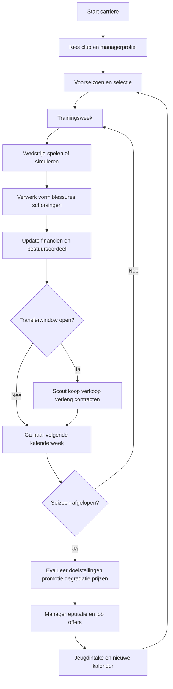
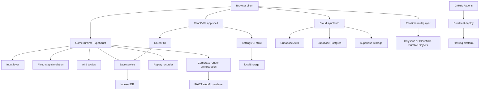

# Bouwdocument voor een browsergebaseerde SWOS-achtige voetbalgame met volledige carrièremodus

## Executive summary

De juiste productstrategie is **geen juridische of mechanische 1-op-1-kopie van Sensible World of Soccer**, maar een **moderne, browser-native spirituele opvolger**: snelle top-down arcadevoetbalactie, één primaire actieknop, zeer leesbare pixel-art, korte input-latency, voelbare balcurve/aftertouch, en een carrièremodus waarin wedstrijden snel speelbaar blijven en managementsystemen diep genoeg zijn om tientallen seizoenen te dragen. Het originele SWOS-handboek benadrukte precies die combinatie van directe besturing en een wereldwijde managementlaag: een carrière van 20 seizoenen, manager of speler-manager zijn, praktisch alle professionele clubs, 26.000+ spelers en 146 competities. Ook de kernbesturing was extreem compact: acht richtingen, een enkele actieknop, korte tik voor pass, langer ingedrukt voor hard schot, en curve/lob/drive door de stick direct ná de trap te bewegen. citeturn1view0turn2view1turn3view0

Voor een browserproject is de beste primaire route: **Vite + React voor shell/UI**, **PixiJS of een lichte WebGL-2D renderer voor de matchlaag**, **een eigen kinematische matchsimulatie in vaste timesteps**, **IndexedDB voor lokale saves**, **Supabase voor account/cloud-sync**, en **online multiplayer pas ná een stabiele lokale singleplayer-vertical-slice**. Die keuze past goed bij het webplatform: Canvas is breed beschikbaar voor 2D-graphics, WebGL levert hardwareversnelde rendering, Vite biedt snelle development en geoptimaliseerde productiebundles, React en Vue zijn componentgebaseerde UI-frameworks, en IndexedDB is expliciet bedoeld voor grotere hoeveelheden gestructureerde offline data. citeturn32search0turn32search2turn7search5turn7search1turn8search0turn15search0

De technische hoofdles uit SWOS is dat de **“feel” belangrijker is dan fysische realiteit**. Matter.js is een volwaardige 2D rigid-body engine met restitutie, wrijving, constraints en botsingsdetectie, maar voor een SWOS-achtig spel is een generieke rigid-body aanpak meestal te moeilijk exact af te stemmen op éénknops arcadevoetbal met voorspelbare passes, beheerste balcurve en leesbare rebounds. Het origineel beschreef een bal die niet “aan je voet vastzit”, lastiger te controleren wordt bij hoge snelheid, en door input na de kick heel gericht laag, hoog, lob of curved kan worden gemaakt; die eigenschappen wijzen veel sterker naar een **eigen, spel-specifiek model** dan naar algemene rigid-body simulatielogica. citeturn1view0turn9search0turn9search1

De carrièremodus moet dieper zijn dan het origineel. Het handboek noemt transfers, tactieken en clubfinanciën, maar beschrijft geen moderne contractonderhandeling, trainingsperiodisering, jeugdacademie, veroudering/pensioen of een rijk reputatiesysteem. Daarom is de aanbevolen productpositionering: **“SWOS-paced matches + FM-lite systems”**. De matchduur en UI moeten compact blijven, terwijl systemen als contracten, scouting, jeugd, trainingsfocus, budgetten, sponsorlogica, bestuurseisen en managerreputatie laagdrempelig maar betekenisvol zijn. citeturn3view0turn2view3

Juridisch moet het project vanaf dag één op **originaliteit en afstand tot beschermde tekens/data** gebouwd worden. In Nederland ontstaan auteursrechten automatisch op games, muziek, kunst en software; merknamen en logo’s moeten apart geregistreerd worden om bescherming te krijgen; handelsnamen ontstaan door gebruik; en databanken kunnen onder databankenrecht vallen. BOIP en EUIPO maken ook expliciet duidelijk dat andermans merken in economisch verkeer niet zomaar gebruikt mogen worden. Voor een commercieel of publiek project betekent dit: **geen “Sensible Soccer” of “SWOS” als productnaam, geen overgenomen logo’s, geen gerecyclede sprites, geen gekopieerde muziek, en geen ongelicentieerde bulkovername van echte spelers-/club-/competitiedata**. citeturn27search0turn26search0turn26search1turn29search2turn30search0

De realistische planning voor een klein senior team is ongeveer **7 tot 10 maanden voor een sterke singleplayer/career beta** en **10 tot 14 maanden als online multiplayer met authoritative backend in scope blijft**. De grootste projectrisico’s zijn niet rendering of infrastructure, maar **matchgevoel**, **AI-leesbaarheid**, **datascope**, **save-migraties**, en **IP/merkafstand**. Daarom moet de Claude-agent het werk uitvoeren in deze volgorde: eerst input, balgevoel, cameravoering en AI-support runs; dán HUD en menus; daarna career systems; en pas daarna online. citeturn21search0turn21search1turn5search5turn23search0

## Doelproduct en spelpijlers

### Wat absoluut behouden moet blijven uit de SWOS-DNA

Het oorspronkelijke SWOS draaide om **compacte bediening met veel expressie**. Terwijl je in balbezit bent, beweeg je in acht richtingen; een korte druk op de actieknop probeert naar de dichtstbijzijnde medespeler te passen in de algemene kijkrichting, een langere druk schiet harder rechtuit, en input direct na de trap bepaalt hoogte en curve. Zonder bal gebruik je dezelfde knop voor sliding tackle of kopbal/interceptie wanneer de bal in de lucht is. Dat is niet zomaar historische trivia; dit is de kern van de spelidentiteit die je in de browser opnieuw moet bouwen. citeturn1view0

Een tweede element is de sterke koppeling tussen **wedstrijdtempo en managementtempo**. Het originele handboek positioneerde SWOS niet alleen als voetbalgame maar expliciet als “complete management game”, waarin je over 20 seizoenen een team kan leiden, job offers kan krijgen en transfers, tactiek en bankbalans beheert. Tegelijk bleef de interactie binnen een wedstrijd extreem direct en snel. De browserclone moet daarom niet uitgroeien tot een traag spreadsheetspel; management moet binnen enkele klikken beslissingen opleveren die zichtbaar terugwerken op het veld. citeturn1view0turn3view0

Een derde element is de **tactische leesbaarheid**. SWOS had een tactiekeditor gebaseerd op 35 balzones en 240 potentiële spelerposities, plus preset- en customtactieken. Dat suggereert een zone-gebaseerde voetbal-interpretatie, niet high-frequency individuele micro-AI. Voor de clone betekent dit: AI moet vooral reageren vanuit ankers, rolzones, passing lanes, pressing-triggers en support triangles, zodat wedstrijden helder en voorspelbaar genoeg blijven om “snel slim” te voelen. citeturn1view0

### Productdefinitie voor deze clone

Ik raad aan het product te definiëren als:

> **Een browser-native, pixel-art top-down arcadevoetbalgame met offline en online vriendschappelijke wedstrijden, lokale multiplayer, en een volledige carrièremodus waarin de speler als manager of speler-manager over tientallen seizoenen een club opbouwt.**

Die definitie doet drie belangrijke dingen. Ten eerste bewaart zij de SWOS-kern. Ten tweede maakt zij ruimte voor moderne systems depth. Ten derde vermijdt zij juridisch riskante taal zoals “remake” of “clone” in externe positionering.

De v1-scope moet bestaan uit:

| Onderdeel | V1-verplichting | V2 of later |
|---|---|---|
| Match engine | Ja | Verdere verfijning |
| Lokale multiplayer | Ja | Ranking/ladder |
| Singleplayer season | Ja | Vereenvoudigde sandboxvarianten |
| Volledige career mode | Ja | Uitbreiding staff/facilities |
| Cloud saves | Ja | Multiplayer cross-progression |
| Online realtime 1v1 | Nice-to-have maar pas na local core | Ja |
| Modding/custom database | Nee, alleen intern voorbereid | Ja |
| Echte clubs/spelers/licenties | Nee | Alleen met licentie |

Deze scopekeuze volgt uit het webplatform en uit de bekende infrastructuurtrade-offs rond realtime. Colyseus en Cloudflare Durable Objects zijn goede bouwstenen voor authoritative multiplayer, maar het ontwikkelen van goede realtime-voetbalcode brengt extra latency-, synchronisatie- en cheat-risico’s mee. Vercel Functions ondersteunen bovendien geen WebSocket-servergedrag, zodat een “alles-op-één-platform”-aanpak daar niet werkt. citeturn5search5turn5search0turn21search0turn21search1turn35search1turn35search2turn35search4

### Werkassumpties voor de Claude-agent

Omdat de opdracht expliciet zegt dat niet-gespecificeerde details **“no specific constraint”** hebben, moet de Claude-agent werken met de volgende pragmatische aannames:

| Parameter | Werkassumptie |
|---|---|
| Browsers | Moderne evergreen browsers; productiebuild gericht op Vite’s brede moderne baseline |
| Platformmodus | Primair webapp, optioneel PWA |
| Monetisatie | Geen constraint; technische keuzes niet laten blokkeren door ads/IAP |
| Doelmarkt | Desktop eerst, touch-support niet blokkeren |
| Data | Fictieve standaarddatabase, importers/licenties later |
| Online | Eerst local/offline core, daarna authoritative online 1v1 |

Vite documenteert dat de productiebuild standaard mikt op **Baseline Widely Available** browsers van ongeveer de afgelopen 2,5 jaar, wat een goede moderne default is zolang je geen legacy-constraint hebt. citeturn7search5

## Gameplay en UX-specificatie

### Matchsimulatie en spelgevoel

De veldlaag moet draaien op een **fixed-step simulatie van 60 Hz** met render-interpolatie. Gebruik `requestAnimationFrame()` voor rendering en houd de simulatietick volledig los van de UI-rendercyclus. MDN benadrukt dat `requestAnimationFrame()` aanpaint met het schermritme en dat je tijdsdelta’s correct moet gebruiken, met name op high-refresh displays; voor worker-architecturen is er bovendien dedicated-worker `requestAnimationFrame()`-ondersteuning in combinatie met een `OffscreenCanvas`-workflow. citeturn16search0turn17search0

De balfysica moet **spel-specifiek en explainable** zijn. Ontwerp de bal als een eigen kinematisch object met ten minste deze componenten:

- grondvector `vx, vy`
- hoogteterm `z`
- verticale snelheid `vz`
- spinvector of curve-coëfficiënt
- oppervlaktemodifier voor pitchconditie
- controlevenster bij eerste aanraking
- rebounddemping bij botsing op speler, paal, keeper of lijn

Het handboek maakt duidelijk dat laag/hoge/lob/curve-variaties ontstaan uit input direct na de trap en uit aanvalsrichting; dat moet 1-op-1 vertaald worden naar een **aftertouch-venster van bijvoorbeeld 120–180 ms** na elke kick. Spelers moeten dus niet “realistisch fysiek” maar **muzikaal bestuurbaar** aanvoelen. citeturn1view0

Voor spelerbesturing raad ik een **contextuele action model** aan:

| Situatie | Primair commando | Secundaire interpretatie |
|---|---|---|
| In balbezit | tap = pass | hold = shot/clear |
| In balbezit kort na first touch | tap = one-touch pass | hold = drive/lob |
| Zonder bal | tap/hold = sliding tackle | nabij luchtbal = header/intercept |
| Stilstaande fase | tap = korte pass | hold = lange bal/voorzet |
| Keeper auto | geen directe control in v1 | later optioneel manual keeper-mod |

Dat blijft trouw aan het origineel en houdt de skill ceiling hoog. Het originele systeem beschreef ook dat de dichtstbijzijnde teamgenoot in de kijkrichting het natuurlijke passdoel is; dat impliceert dat je engine een **soft aiming cone** nodig heeft in plaats van volledig vrije analoge passing in v1. citeturn1view0

### AI-architectuur voor voetbalgevoel

De AI mag niet beginnen als volledige “voetbalkennis-AI”. Begin met een **drielagensysteem**:

1. **Tactische laag**  
   Formatie, rol, team shape, pressinghoogte, compactheid, build-up voorkeur.

2. **Situationele laag**  
   Wie support waar, wie drukt, wie dekt passing lane, wie geeft breedte/diepte, wie valt tweede bal aan.

3. **Actielaag**  
   Run-to-point, face-ball, request-pass, intercept, tackle, shoot, clear, switch-mark.

Dit past goed bij de historische tactiekeditor van SWOS, die spelers aan posities koppelde op basis van balzones. De clone kan daar direct op voortbouwen met moderne data-objecten zoals `FormationAnchor`, `RoleProfile`, `PressTrigger` en `SupportRunPattern`. citeturn1view0

Concreet moet de Claude-agent de volgende AI-routines bouwen, in deze volgorde:

| Prioriteit | Routine | Waarom eerst |
|---|---|---|
| Hoog | Nearest-player switching | Basis van controle-overdracht |
| Hoog | Pass support triangles | Nodig voor vloeiende aanval |
| Hoog | Simple zonal defending | Nodig voor leesbare tegenstand |
| Hoog | Interception prediction | Belangrijker dan “slimme” tackles |
| Middel | Keeper line logic | Houdt scoreline geloofwaardig |
| Middel | Set-piece positioning | Nodig voor complete wedstrijden |
| Middel | Tactical variants | Vormt differentiatie tussen teams |
| Laag | Personality traits | Kan later de sim verrijken |

De AI moet vooral **leesbare intentie** tonen. Beter een iets simpelere maar helder telegraphed pressing-run dan een “slimme” agent die onverklaarbaar beweegt.

### Camera, input mapping en touch

**Camera**  
Gebruik een top-down of licht schuin top-down camera met zachte balvolging, voorspelbare look-ahead en minimale zoom. Het doel is niet cinematische televisie-imitatie, maar permanente leesbaarheid van passing lanes. De camera moet:

- aan de bal koppelen, niet aan de actieve speler;
- horizontale look-ahead hebben bij counters;
- niet schokken bij rebounds of kopduels;
- HUD-safe margins respecteren;
- een “dead zone” rond het midden hanteren.

**Keyboard**  
Voor rebinding moet de inputlaag werken op **`KeyboardEvent.code`** en niet uitsluitend op gegenereerde tekens. Dat is relevant omdat `code` de fysieke toets representeert, onafhankelijk van keyboardlayout, wat veel consistenter is voor actiecontrols. citeturn18search1turn18search0

**Gamepad**  
De webplatform-Gamepad API is breed beschikbaar; gamepad-state kan via events of `navigator.getGamepads()` worden gelezen. Dat maakt browser-local multiplayer en console-achtige besturing haalbaar zonder exotische stack. Gebruik in v1 één primair actieknopslot, één modifierknop voor sprint/precision, en optioneel een tweede knop voor geavanceerde spelerwissel of manual loft. citeturn18search2turn18search3turn18search4

**Touch**  
Voor mobile/touch moet de inputlaag op Pointer Events draaien, omdat die één DOM-model bieden voor muis, touch en pen. Bouw een linker virtuele stick voor beweging, rechter swipe- of gesture-input voor aftertouch en set-piece richting, plus grote tappable UI-zones voor pass/shoot. citeturn19search2turn19search3

### Match-HUD, menu’s en teammanagement-UX

Het originele SWOS ondersteunde in-match management en statistieken zonder de flow te vernietigen: manager’s bench, wissels, tactiekverandering, replay en statistieken waren vanuit de match bereikbaar. Voor de clone moet dat worden vertaald naar een **ultrasnelle overlay-UX** die op controller, keyboard en touch werkt. citeturn1view0turn3view0

**Aanbevolen match-HUD**

| Zone | Inhoud | UX-regel |
|---|---|---|
| Boven midden | score, tijd, cards, extra time | Altijd zichtbaar |
| Boven links/rechts | teamafkortingen + momentum indicator | Klein en leesbaar |
| Onderhoek | context hint voor controls | Verdwijnt na onboarding |
| Subtiele veldmarkering | actieve speler, passdoel-preview | Enkel wanneer nuttig |
| Pauze-overlay | wissels, tactiek, camera, audio | Max 2 lagen diep |

**Menu-architectuur**

De shell moet bestaan uit:

- hoofdmenu
- quick match
- local versus
- career hub
- squad/team management
- transfermarkt
- trainingcentrum
- academy/scouting
- clubfinanciën
- opties/rebindings
- replays/highlights

React is hier een logische keuze omdat het UI uit componenten opbouwt; Vue kan hetzelfde declaratief. Mijn voorkeur is React voor de meta-UI, mits de matchloop níet door React state wordt aangestuurd. Laat React enkel shell, schermnavigatie en dataformulieren beheren; houd de wedstrijdengine in een autonome imperative module. citeturn7search1turn8search0

Een nuttige extra is een **“classic season”** modus naast de volledige career. Het handboek beschrijft immers ook een seizoenmodus die bewust eenvoudiger was en transfers/tactiek/financiën buiten scope hield. Dat is een goed productontwerp voor een browsergame: je geeft casual spelers een korte route en behoudt de diepe career voor de kernspelers. citeturn2view1

## Carrièremodus en datamodel

### Systeemontwerp voor een volledige carrière

De carrièremodus moet bestaan uit een **snelle kernlus**:

1. kalender bekijken  
2. selectie/tactiek/training aanpassen  
3. wedstrijd spelen of simuleren  
4. inkomsten/kosten/resultaten verwerken  
5. reputatie/bestuursvertrouwen updaten  
6. transfer- en contractbeslissingen nemen  
7. seizoensdoelen evalueren  
8. door naar volgende week/maand

Het originele SWOS gaf al duidelijke bouwstenen: squad screen met nationaliteit en waarde, suspensies, blessures, transfers, tactieken, wereldcompetitie-overzicht, club business en job offers. De clone moet diese kern aanhouden, maar uitbreiden tot een volwaardig loop-systeem. citeturn3view0turn2view3

**Aanbevolen systemen**

| Systeem | Minimale v1-diepte | Waarom belangrijk |
|---|---|---|
| Seizoensstructuur | league + domestic cup + continentale kwalificatie | Draagt de langetermijnloop |
| Transfers | buy/sell/loan + shortlist + scout reports | Cruciale squadverandering |
| Contracten | looptijd, salaris, bonus, rol, verlenging | Geeft waarde aan spelersbeslissingen |
| Training | wekelijkse focus, fitheid, vorm, groei | Verbindt menu’s met veld |
| Jeugdacademie | periodieke intake + potentieel/onzekerheid | Houdt lange carrière fris |
| Financiën | salarissen, transferbudget, prijzengeld, sponsor | Geeft keuzes consequenties |
| Reputatie | manager-, club- en competitieprestige | Stuurt job offers en onderhandeling |
| Achievements | campaign goals + meta unlocks | Verhoogt retention |

**Seizoenen en competities**  
Begin met een **fictief maar structuurgetrouw wereldsysteem**: 8 tot 12 landen in v1, elk met 2 à 4 divisies, plus nationale bekers en 1 à 2 continentale toernooien. Dat is genoeg massa voor transfercirculatie zonder dat contentexplosie het project breekt.

**Transfers**  
Het handboek laat filters zien op positie en vaardigheden zoals passing, shooting, heading, tackling, ball control, speed en finishing. Dat is een uitstekende basis voor het scoutingsmodel van de clone: scout reports rapporteren niet “绝对 waarheid”, maar probabilistische ranges op precies die spelrelevante eigenschappen. citeturn2view0

**Contracten**  
Contracts moeten kort blijven in UI maar rijk in consequentie:

- salaris per week/maand
- duur in seizoenen
- squad role
- release clause
- loyalty/morale impact
- renewal window
- Bosman/expiring discount logic

**Training**  
Hou training tactisch-eenvoudig: elke week een focus per team of spelercluster, zoals:

- snelheid
- passing
- finishing
- pressing
- set pieces
- recovery
- youth development focus

**Jeugd**  
Maak jeugd onzeker en spannend. Gebruik verborgen parameters voor potentieel en mentale stabiliteit, en geef de speler alleen ranglabels en scout confidence.

**Financiën**  
De originele game noemde club business en bank balance. In de clone moet dit worden uitgebreid met: loonplafond, transferpot, sponsorbonussen, bestuurseisen, ticketopbrengsten als eenvoudige macrovariabele, en boetes/kosten door blessures of vroegtijdig contractontslag. citeturn2view3turn3view0

**Reputatie en job offers**  
Job offers zaten al in SWOS. In de clone moet reputatie multiaxiaal zijn:

- **resultaatreputatie**: wat win je;
- **ontwikkelreputatie**: hoe verbeter je spelers;
- **financiële reputatie**: houd je budget onder controle;
- **stijlreputatie**: speel je aanvallend/defensief;
- **loyaliteitsreputatie**: job hopping vs clubbouw.

### Aanbevolen dataschema’s

Onderstaande schema’s zijn compact genoeg voor implementatie door een Claude-agent, maar rijk genoeg voor alle genoemde career-systemen.

```ts
type UUID = string;

type Team = {
  id: UUID;
  worldId: UUID;
  name: string;
  shortName: string;
  city: string;
  countryCode: string;
  divisionId: UUID;
  colors: {
    primary: string;
    secondary: string;
    trim: string;
    goalkeeperPrimary: string;
  };
  stadium: {
    name: string;
    capacity: number;
    attendanceBase: number;
    pitchTypeBias: "normal" | "soft" | "hard" | "wet";
  };
  board: {
    patience: number;          // 0..100
    ambition: number;          // 0..100
    financeDiscipline: number; // 0..100
    youthPreference: number;   // 0..100
  };
  finances: {
    balance: number;
    wageBudget: number;
    transferBudget: number;
    sponsorTier: number;
    debt: number;
  };
  reputation: {
    domestic: number;
    continental: number;
    youth: number;
  };
  tacticalIdentity: {
    tempo: number;
    width: number;
    press: number;
    directness: number;
  };
};

type Player = {
  id: UUID;
  teamId: UUID | null;
  firstName: string;
  lastName: string;
  nationality: string;
  birthDate: string;
  ageYears: number;
  preferredPositions: Array<"GK" | "RB" | "LB" | "CB" | "DM" | "CM" | "AM" | "RW" | "LW" | "ST">;
  foot: "L" | "R" | "B";
  attributes: {
    pace: number;
    stamina: number;
    ballControl: number;
    passing: number;
    shooting: number;
    finishing: number;
    heading: number;
    tackling: number;
    composure: number;
    aggression: number;
    consistency: number;
    flair: number;
    goalkeeping?: number;
  };
  hidden: {
    potential: number;
    injuryProneness: number;
    professionalism: number;
    loyalty: number;
  };
  status: {
    morale: number;
    fitness: number;
    sharpness: number;
    form: number;
    injury: null | { type: string; daysRemaining: number };
    suspensionMatchesRemaining: number;
  };
  market: {
    estimatedValue: number;
    askingPrice: number | null;
    wageDemand: number;
    interestScore: number;
  };
};

type Contract = {
  id: UUID;
  playerId: UUID;
  teamId: UUID;
  startDate: string;
  endDate: string;
  salaryPerWeek: number;
  role: "Prospect" | "Rotation" | "Starter" | "Key" | "Star";
  squadNumber: number | null;
  releaseClause: number | null;
  extensionOptionYears: number;
};

type Match = {
  id: UUID;
  seasonId: UUID;
  competitionId: UUID;
  roundLabel: string;
  date: string;
  homeTeamId: UUID;
  awayTeamId: UUID;
  venueTeamId: UUID;
  kickoffWeather: "dry" | "wet" | "snow" | "windy";
  pitchType: "normal" | "hard" | "soft" | "muddy" | "frozen";
  state: "scheduled" | "played" | "abandoned";
  score: {
    home: number;
    away: number;
    aetHome?: number;
    aetAway?: number;
    pensHome?: number;
    pensAway?: number;
  };
  xArcadeMeta: {
    possessionHomeApprox: number;
    shotsHome: number;
    shotsAway: number;
    motmPlayerId: UUID | null;
  };
};

type Season = {
  id: UUID;
  worldId: UUID;
  label: string;               // "1997/1998"-achtig of fictieve kalender
  currentDate: string;
  transferWindows: Array<{
    startDate: string;
    endDate: string;
    type: "summer" | "winter" | "special";
  }>;
  competitions: UUID[];
  promotedRelegatedResolved: boolean;
};

type CareerSave = {
  id: UUID;
  profileName: string;
  createdAt: string;
  updatedAt: string;
  manager: {
    name: string;
    reputation: {
      result: number;
      style: number;
      finance: number;
      development: number;
    };
    currentTeamId: UUID;
    achievements: string[];
  };
  worldState: {
    activeSeasonId: UUID;
    teams: Team[];
    players: Player[];
    contracts: Contract[];
    matches: Match[];
    seasons: Season[];
  };
  meta: {
    saveVersion: number;
    checksum: string;
    difficulty: "Easy" | "Normal" | "Hard";
  };
};
```

**Datamodelprincipes**

- `saveVersion` is verplicht voor migraties.
- Contracts zijn aparte records, geen geneste velden in `Player`.
- Matchresultaten worden immutable gelogd; standings worden daaruit afgeleid of gecachet.
- Hidden attributes zijn cruciaal voor scout uncertainty en emergent verhalen.
- Werelddata moet seedbaar zijn zodat deterministische regen/newgens mogelijk worden.

### Carrièreloop in mermaid



## Technische architectuur en stackkeuze

### Aanbevolen architectuur

De aanbevolen architectuur is een **gescheiden game-runtime en app-shell**:

- **App-shell**: React + Vite voor routing, menu’s, formulieren, instellingen, save management.
- **Game-runtime**: losse TypeScript package/module voor input, sim, AI, camera, replay en render orchestration.
- **Renderer**: PixiJS via WebGL als primaire route; Canvas fallback alleen voor tooling of debug views.
- **Persistence**: IndexedDB lokaal; cloud save via Supabase/Postgres/Auth/Storage.
- **Multiplayer**: eerst local multiplayer; daarna authoritative rooms via Colyseus of Cloudflare Durable Objects.
- **Build/CI**: GitHub Actions.
- **Deploy**: Cloudflare Pages als voorkeursroute voor browsergame + edge primitives.

Die splitsing voorkomt dat React-rendering de wedstrijdfrequentie verstikt. React is sterk in UI-componenten; het is geen game loop. PixiJS documenteert expliciet dat zijn renderers gericht zijn op high-performance GPU-accelerated rendering via WebGL/WebGL2, waarbij WebGL voor productie wordt aanbevolen. Canvas en WebGL zijn beide breed beschikbaar, maar WebGL is de logische hoofdroute voor sprite-intensieve 2D action games. citeturn7search1turn7search5turn4search2turn32search0turn32search2

### Vergelijking van stackrichtingen

De bronkolom onderbouwt de platformclaims; de “fit”-beoordeling is mijn synthese voor dit specifieke project.

| Stackrichting | Samenstelling | Sterke punten | Zwakke punten | Fit |
|---|---|---|---|---|
| **Aanbevolen** | Vite + React + PixiJS + custom sim + IndexedDB + Supabase + Cloudflare Pages/DO | Zeer snelle web-UI workflow, sterke 2D rendering, heldere scheiding tussen UI en matchloop, goede offline save-opties, sterke cloud primitives | Meer eigen enginewerk dan bij Phaser | **Hoog** citeturn7search5turn7search1turn4search2turn15search0turn34search0turn21search3turn21search0 |
| Phaser-centrisch | Vite + React + Phaser + Colyseus + Supabase | Meer out-of-the-box gameframework, makkelijke scene-flow, multiplayerpad met authoritative state | Phaser abstraheert soms te veel voor een heel specifieke balfeel; shell/game split moet strak bewaakt worden | Middel-hoog citeturn4search1turn5search5turn5search0turn34search0 |
| Minimalistisch | Vite + vanilla TS + Canvas2D + IndexedDB | Kleinste stack, lage afhankelijkheid, maximale controle | Meer eigen render- en toolingwerk, sneller plafondeffect bij effecten/UI-complexiteit | Middel citeturn7search5turn32search0turn15search0 |
| Vue-variant | Vite + Vue + PixiJS + custom sim | Declaratieve UI, lichtgewicht shell, vergelijkbaar met React-route | Minder waarschijnlijk standaardkeuze voor game-LLM agents en voorbeeldcode | Middel-hoog citeturn8search0turn7search5turn4search2 |

### Vergelijking van kernlibraries

| Categorie | Optie | Wat de officiële docs zeggen | Advies |
|---|---|---|---|
| 2D rendering | PixiJS | WebGL/WebGL2 is de aanbevolen, stabiele productierenderer; WebGPU is nog experimenteel. citeturn4search2 | Beste keuze voor spritegedreven matchlaag |
| 2D/game framework | Phaser | Phaser heeft een expliciete WebGL-renderinglaag en brede browsergamefocus. citeturn4search1 | Goed alternatief, vooral als team liever engine-conventies volgt |
| Physics | Matter.js | Volwaardige 2D rigid-body engine met massa, restitutie, botsingen, constraints en frictie. citeturn9search0turn9search1 | Gebruik hoogstens voor tooling/prototypes; niet als primaire matchfysica |
| Multiplayer server | Colyseus | Authoritative rooms, state sync, matchmaking en room isolation zijn first-class features. citeturn5search5turn5search3turn5search0 | Zeer geschikt als Node-gebaseerde matchserver |
| Realtime data/platform | Supabase | Full Postgres, Auth, Storage en Realtime via websockets/logical replication, met RLS-integratie. citeturn34search0turn34search2turn34search4turn34search5 | Zeer geschikt voor save sync, accounts en light realtime |
| Audio | howler.js | Web Audio als default, HTML5 Audio fallback, audio sprites en caching. citeturn13search0 | Prima keuze voor cross-browser game-audio |
| E2E testing | Playwright | Eén API voor Chromium, Firefox en WebKit, met tracing en parallelisme. citeturn25search1turn25search2 | Aanbevolen voor browsermatrix en regressie |
| Unit/integration tests | Vitest | TypeScript werkt out of the box bovenop Vite. citeturn25search0 | Aanbevolen voor sim, schema’s en utilities |

### Renderingopties

| Renderer | Platformfeit | Projectfit | Oordeel |
|---|---|---|---|
| Canvas 2D | Breed beschikbaar en geschikt voor 2D graphics, animatie en game graphics. citeturn32search0 | Goed voor tools/debug en eenvoudige prototypes | Niet mijn eerste keus als eindrenderer |
| WebGL | High-performance interactieve 2D/3D graphics met hardwareversnelling in de browser. citeturn32search2 | Sterk voor sprites, camera, shader-effecten en performance headroom | **Beste hoofdroute** |
| SVG | Sterk voor vectorvormen en UI-illustraties. citeturn32search5turn32search4 | Handig voor logo’s, iconen en niet-frequente UI-elementen | Niet als primaire matchrenderer |

### Save- en syncstrategie

Voor saves zijn er drie lagen nodig:

| Laag | Technologie | Waarom |
|---|---|---|
| Settings en keybinds | `localStorage` | klein, eenvoudig, direct toegankelijk |
| Career saves en replays | IndexedDB | async, gestructureerde data, grotere volumes |
| Cloud sync/account | Supabase Postgres + Auth + Storage | cross-device saves, auth, asset/replay opslag |

MDN maakt expliciet onderscheid tussen Web Storage en IndexedDB: `localStorage` en `sessionStorage` zijn synchroon en key/value-string-gebaseerd, terwijl IndexedDB asynchroon is en bedoeld is voor grotere hoeveelheden gestructureerde data. citeturn14search2turn14search4turn15search0turn15search1

De Claude-agent moet daarom het save-systeem als volgt implementeren:

- `localStorage` alleen voor settings, master audio, input profiles, laatste scherm.
- IndexedDB voor:
  - career save snapshots
  - auto-saves
  - replay blobs
  - cached atlases metadata
- Supabase voor:
  - user profile
  - cloud save manifest
  - optional conflict resolution
  - replay upload sharing

Supabase documenteert dat elk project een volledige Postgres-database heeft en dat Auth, Storage en Realtime daarop voortbouwen. Dat maakt het een goede “back office” voor een browsergame die geen eigen zware backend wil bouwen in v1. citeturn34search5turn4search3turn34search3turn34search4

### Multiplayer- en hostingopties

#### Netwerkmodel

Voor een voetbalgame is mijn advies:

- **v1**: local multiplayer + async save sync, géén online realtime verplichting
- **v1.5**: online friendlies 1v1
- **v2**: ranked 1v1 en spectate/replays

Voor browser multiplayer zijn er drie serieuze routes:

| Model | Platformbasis | Pluspunten | Minpunten | Advies |
|---|---|---|---|---|
| Authoritative room server | Colyseus / Cloudflare Durable Objects | Anti-cheat beter, room state centraal, replay/canonical state eenvoudiger | Meer backendwerk | **Aanbevolen** citeturn5search5turn5search0turn21search0turn21search1 |
| Client/server events | Socket.IO | Robuust, reconnects, fallback naar long-polling | Minder game-specifiek dan Colyseus, meer eigen stateprotocol | Goed alternatief citeturn6search0 |
| Peer-to-peer | WebRTC DataChannel | Lage latency, direct peerverkeer, beveiligd via DTLS | NAT/signaling/host advantage/cheat complexiteit | Alleen later voor private friendlies citeturn5search4turn5search1 |

#### Hostingopties

| Platform | Relevante officiële eigenschappen | Goed voor | Belangrijkste caveat | Oordeel |
|---|---|---|---|---|
| **Cloudflare Pages + Durable Objects** | Pages biedt full-stack deployments, rollback, functions; Durable Objects geven stateful serverless compute, strong consistency en WebSocket support, inclusief hibernation. citeturn21search3turn21search0turn21search1 | Browsergame frontend + realtime matchrooms | Deploys verbreken bestaande WebSockets bij code-updates. citeturn21search1 | **Beste overall fit** |
| **Vercel + externe realtime provider** | Preview deployments via Git, Node runtime, serverless functions; maar Vercel Functions ondersteunen geen WebSocket server; Vercel verwijst hiervoor naar derden. citeturn22search0turn22search1turn22search5turn35search1turn35search2turn35search4 | UI-heavy frontendteams met sterk Vercel-proces | Realtime multiplayer moet extern worden opgelost | Goed voor shell, middelmatig voor native multiplayer |
| **Netlify + externe backend** | Git-based continuous deploys, atomic deploys, serverless functions. citeturn20search2turn20search3turn20search0 | Statische frontend, docs, marketing site, simpele API’s | Minder first-party game-realtimeverhaal | Goed voor site/deploy eenvoud, niet mijn multiplayervoorkeur |

**Deploymentadvies**  
Als online multiplayer werkelijk in scope is, is **Cloudflare Pages + Durable Objects** de meest coherente route. Als online pas later komt en het team al Vercel-ervaring heeft, kun je prima starten met **Vite/React op Vercel + Supabase**, maar wees dan expliciet dat realtime later wordt uitbesteed aan Colyseus/PartyKit/Ably/Supabase Realtime of een eigen matchserver. citeturn21search0turn21search1turn35search1turn34search4

### Systeemarchitectuur in mermaid



## Art, audio en juridische randvoorwaarden

### Pixel-art en asset pipeline

Het visuele doel moet zijn: **hoog leesbare spelers, niet nostalgie om de nostalgie**. Kies één vaste interne resolutie, bijvoorbeeld **320×180** of **384×216**, met integer scaling. De pitch, spelers en HUD moeten in die resolutie ontworpen worden; laat de browser alleen op integer multipliers of nette letterboxing schalen.

Voor spelersprites adviseer ik:

| Asset | Aanbevolen formaat |
|---|---|
| Speler basisframe | 24×24 of 32×32 px |
| Keeper | 32×32 of 40×32 px |
| Bal | 8×8 of 10×10 px |
| Run animatie | 6–8 frames per richting |
| Kick animatie | 3–5 frames |
| Slide tackle | 4–6 frames |
| Header/jump | 3–4 frames |
| Keeper dive | 5–7 frames per zijde |

Gebruik **8 richtingen** voor beweging om trouw te blijven aan de kernbesturing van het origineel. Aseprite ondersteunt het bewaren van broninformatie in `.aseprite` en het exporteren van sprite sheets of PNG-sequences; TexturePacker kan vervolgens geoptimaliseerde sheets en JSON/XML-gebaseerde metadata genereren, inclusief trimming en dataformaten voor engines. citeturn10search5turn10search0turn11search4turn11search3

**Aanbevolen asset pipeline**

1. bronbestanden in `.aseprite`
2. tags per animatieclip (`run_n`, `run_ne`, `kick_e`, enz.)
3. export naar PNG + JSON
4. pack naar atlas met TexturePacker of eigen buildstep
5. hash-based filenames
6. game manifest genereren
7. runtime warm-load of lazy-load per scene

Deze pipeline is robuust, agent-vriendelijk en CI-vriendelijk.

### Audio, muziek en browserbeperkingen

Audio moet **sober maar responsief** zijn. De minimale set:

| Audiofamilie | Nodige assets |
|---|---|
| UI | hover, confirm, cancel, error |
| Match SFX | kick, soft touch, tackle, save, woodwork, whistle |
| Crowd | ambient low, chant rise, goal swell |
| Commentary substitute | optional stingers, geen echte commentary nodig in v1 |
| Muziek | menu theme, career menu loop, cup/finale stinger |

howler.js is hier praktisch omdat het Web Audio standaard gebruikt en terugvalt naar HTML5 Audio, audio sprites ondersteunt en caching biedt. De Web Audio API zelf is krachtig en browserbreed beschikbaar. Tegelijk moet de Claude-agent rekening houden met browser-autoplayregels: hoorbare audio start vaak pas nadat de gebruiker heeft geklikt/getapt. citeturn13search0turn12search1turn12search0

**Audio-implementatieadvies**

- gebruik howler.js voor playback-abstrahering;
- laad SFX als audio sprites om request count te beperken;
- start audio-engine pas na eerste user gesture;
- houd crowd als layerable loops;
- separaat volume voor music, UI en match;
- gebruik OGG/WebM als primary waar mogelijk, MP3 fallback.

### Juridische en IP-randvoorwaarden

De belangrijkste juridische boodschap is simpel: **maak een originele game die mechanisch geïnspireerd is, maar niet inhoudelijk of merkmatig afgeleid**.

Rijksoverheid legt uit dat auteursrecht automatisch ontstaat op onder meer games, muziek en software; merkrecht beschermt product- en dienstnamen, logo’s en soms vorm/verpakking, maar vereist registratie; handelsnaamrecht ontstaat door gebruik; databanken kunnen onder databankenrecht vallen wanneer substantieel in de inhoud is geïnvesteerd. citeturn27search0

BOIP zegt expliciet dat merken in het register intellectueel eigendom van andere partijen zijn en daarom niet zomaar in economisch verkeer gebruikt mogen worden. EUIPO beheert bovendien Uniemerken en -modellen voor de hele EU. citeturn26search0turn29search2

Daaruit volgen harde projectregels:

| Risicogebied | Niet doen | Wel doen |
|---|---|---|
| Productnaam | “Sensible Soccer”, “SWOS”, of verwarrend vergelijkbare titel gebruiken | Nieuwe merknaam en vooraf merkcheck bij BOIP/EUIPO |
| Logo/branding | Retro-logo’s, lettervormen of bekende slogans nabootsen | Eigen visuele identiteit ontwerpen |
| Art | Sprites, UI, pitchgraphics of box-art overnemen | Volledig originele pixel-art pipeline |
| Audio | Muziek/SFX rippen of te dicht nadoen | Eigen composities of correct gelicenseerde packs |
| Code | Source/rom hacks of gedecompileerde logica hergebruiken | Eigen codebase |
| Database | Grote bulkextractie van echte spelers/clubdatasets zonder licentie | Fictieve database of gelicenseerde data |

De EU-databankrichtlijn beschermt databases als verzamelingen geordende gegevens en verbiedt onder het sui generis recht ongeautoriseerde extractie/hergebruik van substantiële delen. De Nederlandse overheid noemt databankenrecht eveneens expliciet als IE-categorie. Dus ook als individuele feiten als zodanig niet auteursrechtelijk beschermd zijn, moet je wegblijven van bulkovername van commerciële databases. citeturn30search0turn30search1turn27search0

Voor scraping en data mining geldt bovendien dat EU-regels rond text-and-data mining uitzonderingen kennen, maar die zijn geen vrijbrief om beschermde datasets om te zetten naar commerciële gamecontent. Als je productiecontent wilt met echte clubs, competities en spelers, moet je licenseren. Zo niet, genereer een fictieve wereld. citeturn29search5turn30search0

### Privacy, analytics en cookies

Als je analytics wilt, kies dan bij voorkeur voor een setup die **geen tracking-cookies nodig heeft**. De Autoriteit Persoonsgegevens stelt dat tracking cookies toestemming vereisen, dat cookiebanners niet misleidend mogen zijn, en dat functionele en niet-privacygevoelige analytische cookies onder voorwaarden buiten het toestemmingsvereiste kunnen vallen. Plausible positioneert zich expliciet als privacyvriendelijk, cookievrij en EU-hosted. citeturn28search1turn28search0turn28search34turn24search0turn24search2

Mijn advies:

- **Plausible** voor productanalytics in v1;
- **Sentry** voor foutmonitoring;
- géén third-party adtech of fingerprinting;
- cookiebanner alleen wanneer juridisch vereist door feitelijke trackingkeuzes.

Sentry biedt first-class JavaScript SDK support voor browserapps en frameworks. citeturn24search3turn24search1

## Uitvoering, QA, deployment en raming

### Uitvoerbare roadmap voor een Claude-agent

Onderstaande roadmap is specifiek geordend om het grootste risico vroeg te reduceren: **spelgevoel eerst, diepte later**.

| Fase | Doel | Taken voor Claude-agent | Output |
|---|---|---|---|
| Preproductie | Repostructuur en technische basis | monorepo opzetten, Vite shell, game runtime package, lint/test/build, asset manifest, save abstractions | compileerbare basisrepo |
| Vertical slice match | Het spel moet “lekker” voelen | input mapping, fixed-step sim, balmodel, speler switching, camera, passing/shooting, tackle/intercept, 2 teams, 1 stadion, HUD basis | speelbare vriendschappelijke wedstrijd |
| AI en tactiek | Leesbare tegenstander en teamvorm | zone-analyzers, support runs, simple defend/press, keeper basics, set pieces light, formatie-editor light | complete match met singleplayer tegen AI |
| Career alpha | Doorlopende wereldloop | kalender, squad, contracts, transfers, finances, injuries, suspensions, board goals, auto-save | één speelbaar carrièreseizoen |
| Career beta | Diepte en content | training, youth academy, scouting, job offers, achievements, multiple leagues, season transitions, promotion/relegation | meerdere seizoenen stabiel |
| Online/progression | Optionele uitbreiding | authoritative room server, sync protocol, reconnect, cloud save conflict resolution, replay share | online friendly matches |
| Content/polish | Retentie en shipping | extra teams/leagues, balancing, SFX/music pass, onboarding, accessibility, QA hardening | releasable beta |

### Deliverables

| Deliverable | Inhoud | Verplicht |
|---|---|---|
| Product spec | scope, mechanics, UX flows, ruleset, balancing assumptions | Ja |
| Technical design doc | architecture, state model, storage, networking, deployment | Ja |
| Match engine package | pure sim, replay system, deterministic tests | Ja |
| UI shell | menus, HUD, career screens, settings, rebinding | Ja |
| Career data layer | schema’s, migrations, generators, seed data | Ja |
| Art bible | palette, sprite dimensions, animation naming, atlas rules | Ja |
| Audio brief | event map, mix levels, music moodboards, browser unlock flow | Ja |
| QA plan | unit, integration, perf, E2E, browser matrix | Ja |
| CI/CD pipeline | GitHub Actions + preview/staging/prod flows | Ja |
| Legal/IP checklist | naming, brand clearance, asset origin ledger, takedown process | Ja |

### Acceptatiecriteria

| Epic | Acceptatiecriterium |
|---|---|
| Matchgevoel | 60 FPS op moderne desktop, input-latency voelt direct, pass/shoot/aftertouch zijn consistent reproduceerbaar in testscenes |
| AI | AI kan verdedigen, opbouwen, pressen en afwerken zonder zichtbare “domme loops” in 10 volledige testwedstrijden |
| Career | Minstens 5 testseizoenen doorlopen zonder corrupte save, scheduling deadlocks of financiële softlocks |
| Saves | Lokale auto-save, manual save en restore werken; schema-migratie naar volgende saveversie getest |
| UI | Alle core flows zijn controller-, keyboard- en muisbruikbaar; touchflow minimaal voor quick match en career navigation |
| Deployment | Elke PR maakt preview build; main branch deployt na groene checks |
| Legal | Publieke build bevat alleen assets met aantoonbare herkomst; merknaam en logo zijn vooraf gecheckt |
| QA | Playwright smoke tests groen op Chromium, Firefox en WebKit; vitest-suite groen in CI |

GitHub Actions ondersteunt workflows voor build, test en deployment, inclusief omgevingen, concurrency en protectieregels. Playwright kan hetzelfde testpakket draaien over Chromium, Firefox en WebKit. citeturn23search0turn23search1turn25search1turn25search2

### QA-strategie

De QA-strategie moet vier lagen hebben.

**Simulatietests**  
Vitest voor pure functions: baltrajecten, collision resolution, form-updates, transferregels, budget updates, fixture generation. Omdat Vitest direct met Vite en TypeScript samenwerkt, is dit de snelste route voor een TS-centrische gamecodebase. citeturn25search0

**Deterministische replay tests**  
Elke wedstrijd moet uit inputevents herleidbaar zijn. Save per frame of per tick een checksum van kritieke state. Dit is essentieel voor multiplayer-debugging én voor regressies in singleplayer.

**Browser-E2E**  
Playwright smoke tests voor:
- opstarten app
- quick match flow
- scoregoal flow
- career save/load
- transfer screen
- cloud login/logout
- settings rebind

Playwright is hier sterk omdat één API Chromium, Firefox en WebKit afdekt. citeturn25search1turn25search2

**Performance QA**  
Meet:
- frame time p50/p95
- atlas memory
- garbage collection spikes
- match load time
- save serialize/deserialize time
- replay size per match

### CI/CD, hosting en observability

**CI/CD-aanpak**

1. `pull_request`  
   lint + unit + deterministic tests + Playwright smoke + preview deploy

2. `main`  
   full suite + staging deploy

3. tagged release  
   prod deploy + changelog + migration checks

GitHub Actions is hiervoor geschikt als centrale CI/CD-laag; Vercel, Netlify en Cloudflare ondersteunen allen Git-gedreven preview/deploy workflows. citeturn23search0turn23search1turn22search0turn20search2turn21search3

**Analytics & observability**

| Doel | Tool |
|---|---|
| Product usage | Plausible |
| Runtime errors | Sentry |
| Realtime usage | Supabase reports of eigen metrics |
| Multiplayer room health | custom room telemetry / DO metrics |

Supabase biedt rapportage over connected clients, broadcasts en change events, wat nuttig is zodra cloud sync of realtime features aan staan. citeturn34search9

### Teamrollen, tijd en ruwe kostenraming

Onderstaande raming is een **planningsaanname**, geen marktmeting. Ik ga uit van een klein senior indie/webgame-team.

| Rol | Gemiddelde inzet | Looptijd |
|---|---|---|
| Tech lead / gameplay engineer | 1.0 FTE | hele project |
| Frontend/UI engineer | 0.75 FTE | hele project |
| Backend/network engineer | 0.5 FTE, later 1.0 als online | middelste/late fases |
| Game designer/producer | 0.5 FTE | hele project |
| Pixel artist/animator | 1.0 FTE | vooral middenfase |
| Audio/composer | 0.2–0.4 FTE | slice + polish |
| QA engineer | 0.3 FTE vroeg, 0.8 FTE laat | hele project |
| Legal/IP review | burst basis | prelaunch + naming |

**Indicatieve tijd**

| Scope | Doorlooptijd |
|---|---|
| Singleplayer + career beta, geen online | 7–10 maanden |
| Inclusief online realtime 1v1 | 10–14 maanden |
| Inclusief bredere content/multiple continents/modding | 14+ maanden |

**Indicatieve kosten op basis van blended teammodel**

| Scope | Ruwe bandbreedte |
|---|---|
| Lean singleplayer/career project | €300k–€450k |
| Met online en zwaardere contentpass | €450k–€700k+ |

### Risico’s en mitigaties

| Risico | Impact | Kans | Mitigatie |
|---|---|---|---|
| Match voelt “net niet SWOS-achtig” | Zeer hoog | Hoog | vertical slice eerst; wekelijkse feel reviews; geen generic rigid-body als hoofdpad |
| Career scope explodeert | Hoog | Hoog | systems taxonomy, v1 minimum depth, landen/divisies gefaseerd toevoegen |
| Save corruption / migration bugs | Hoog | Middel | saveVersion, migration harness, golden test saves |
| AI oogt chaotisch | Hoog | Middel | zone-based anchors en simpele leesbare regels eerst |
| Realtime multiplayer vertraagt project | Hoog | Hoog | online pas ná singleplayer beta; authoritatieve server vanaf start als online wordt gebouwd |
| Browser audio issues op mobiel | Middel | Hoog | audio unlock flow na eerste interaction; fallback gedrag testen |
| IP-claim door naam/branding/data | Zeer hoog | Middel | fictieve data, merkcheck, asset-origin ledger, juridisch reviewmoment |
| Privacy/cookie non-compliance | Middel | Middel | privacyvriendelijke analytics, geen trackingcookies zonder consent |
| Deploy breekt live WebSockets | Middel | Middel | rolling deploy strategy, room-drain logic, scheduled maintenance notice bij online mode |

### Open vragen en beperkingen

Er zijn een paar punten die bewust als ontwerpkeuze open blijven en die de Claude-agent vroeg moet concretiseren:

- Hoe “modern” moet het voetbalregelsysteem zijn: klassieke retro feel of actuele 5-wissel/VAR-loze modernisering?
- Wil je de career-wereld volledig fictief houden, of later een licentiepad openlaten?
- Wordt mobiele gameplay een serieuze doelgroep of alleen “supported but not primary”?
- Komt online ranked play echt in scope, of blijft multiplayer beperkt tot friendlies?
- Wil je PWA-installability en offline shell shipping in v1 of pas na beta? Service workers en PWA’s kunnen dat ondersteunen, maar vergroten update- en cachecomplexiteit. citeturn33search0turn33search2

Mijn eindadvies is helder: **bouw eerst een juridisch schone, fictieve, browser-native spirituele opvolger met perfecte match-feel en compacte career depth; behandel realtime online als een tweede projectfase, niet als een startvoorwaarde.** Dat is de route met de hoogste kans op een speelbaar, onderscheidend en uitvoerbaar resultaat.